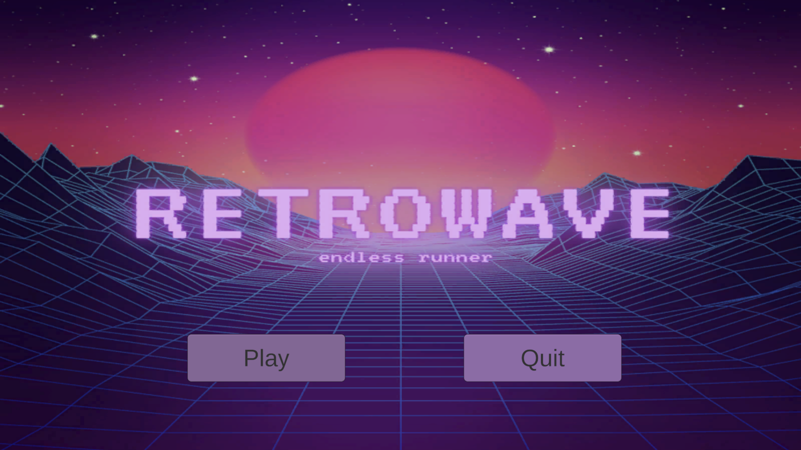
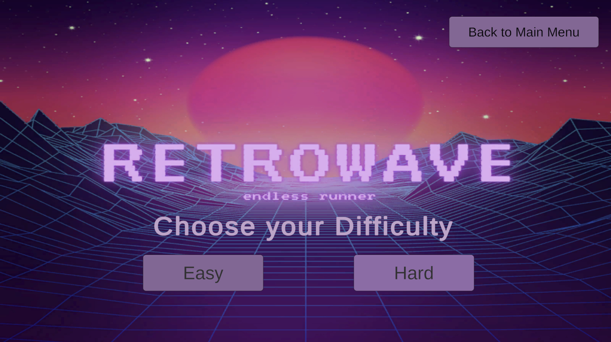
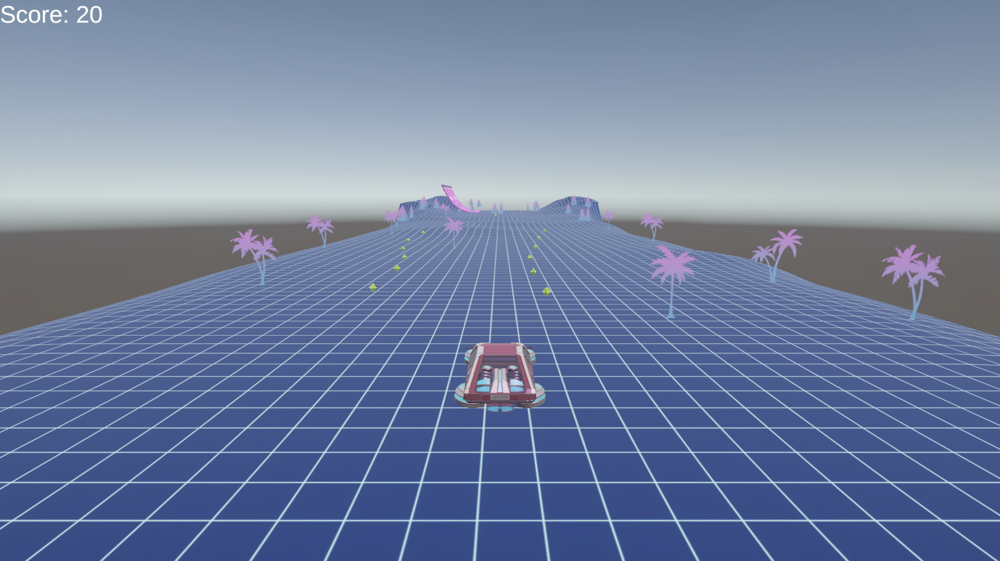
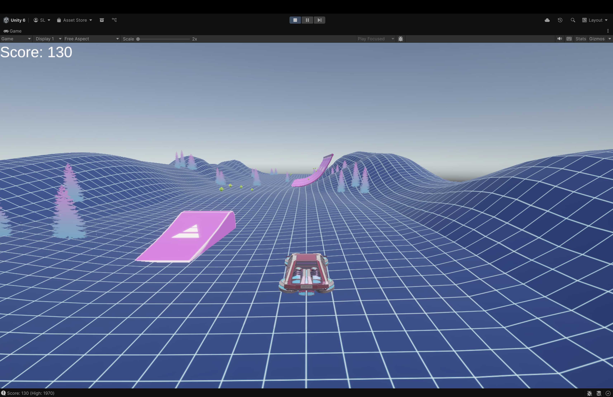
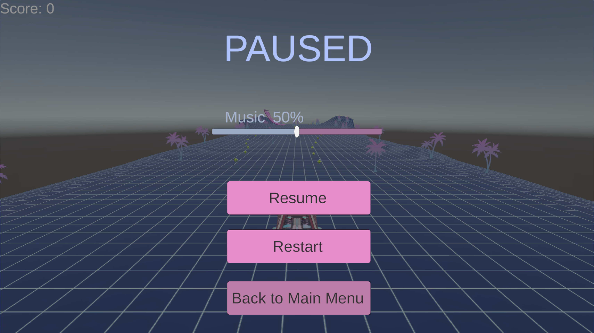
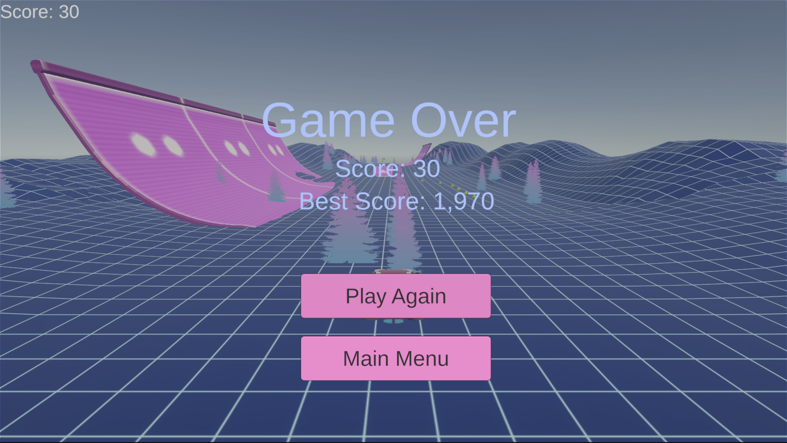

# Sky Runner

## Description

Sky Runner is an exciting endless runner game built with Unity where players control a hovering vehicle navigating through procedurally generated roads. Players must avoid obstacles while collecting gems to achieve the highest score possible. The game features dynamic physics-based movement with hovering mechanics, banking turns, and responsive controls.

### Key Features
- **Endless Gameplay**: Procedurally generated road segments for infinite gameplay
- **Physics-Based Movement**: Realistic hovering vehicle with bounce mechanics
- **Scoring System**: Collect gems to increase your score and beat your high score
- **Difficulty Levels**: Choose between Easy and Hard modes
- **Pause System**: Pause and resume gameplay at any time
- **Smooth Camera**: Dynamic camera that follows the player smoothly
- **Game Management**: Complete game state management with game over and restart functionality

### Gameplay Mechanics
- **Movement**: Use arrow keys or WASD to move left and right
- **Hovering**: The vehicle automatically maintains hover height above the ground
- **Banking**: Vehicle banks (tilts) realistically during turns
- **Collision**: Hit an obstacle to trigger game over
- **Collection**: Fly through gems to collect points
- **Bouncing**: Vehicle bounces when hitting the ground at high speed

## Screenshots

- Main menu screen
  
- Level selection screen
  
- Gameplay in action
  
  
- Pause screen
  
- Game over screen
  

## Development Team

### Members
- **Soe Min Min Latt**
- **Aung Khant Zaw**

## License

MIT License

Copyright (c) 2024 Soe Min Min Latt, Aung Khant Zaw

Permission is hereby granted, free of charge, to any person obtaining a copy
of this software and associated documentation files (the "Software"), to deal
in the Software without restriction, including without limitation the rights
to use, copy, modify, merge, publish, distribute, sublicense, and/or sell
copies of the Software, and to permit persons to whom the Software is
furnished to do so, subject to the following conditions:

The above copyright notice and this permission notice shall be included in all
copies or substantial portions of the Software.

THE SOFTWARE IS PROVIDED "AS IS", WITHOUT WARRANTY OF ANY KIND, EXPRESS OR
IMPLIED, INCLUDING BUT NOT LIMITED TO THE WARRANTIES OF MERCHANTABILITY,
FITNESS FOR A PARTICULAR PURPOSE AND NONINFRINGEMENT. IN NO EVENT SHALL THE
AUTHORS OR COPYRIGHT HOLDERS BE LIABLE FOR ANY CLAIM, DAMAGES OR OTHER
LIABILITY, WHETHER IN AN ACTION OF CONTRACT, TORT OR OTHERWISE, ARISING FROM,
OUT OF OR IN CONNECTION WITH THE SOFTWARE OR THE USE OR OTHER DEALINGS IN THE
SOFTWARE.
